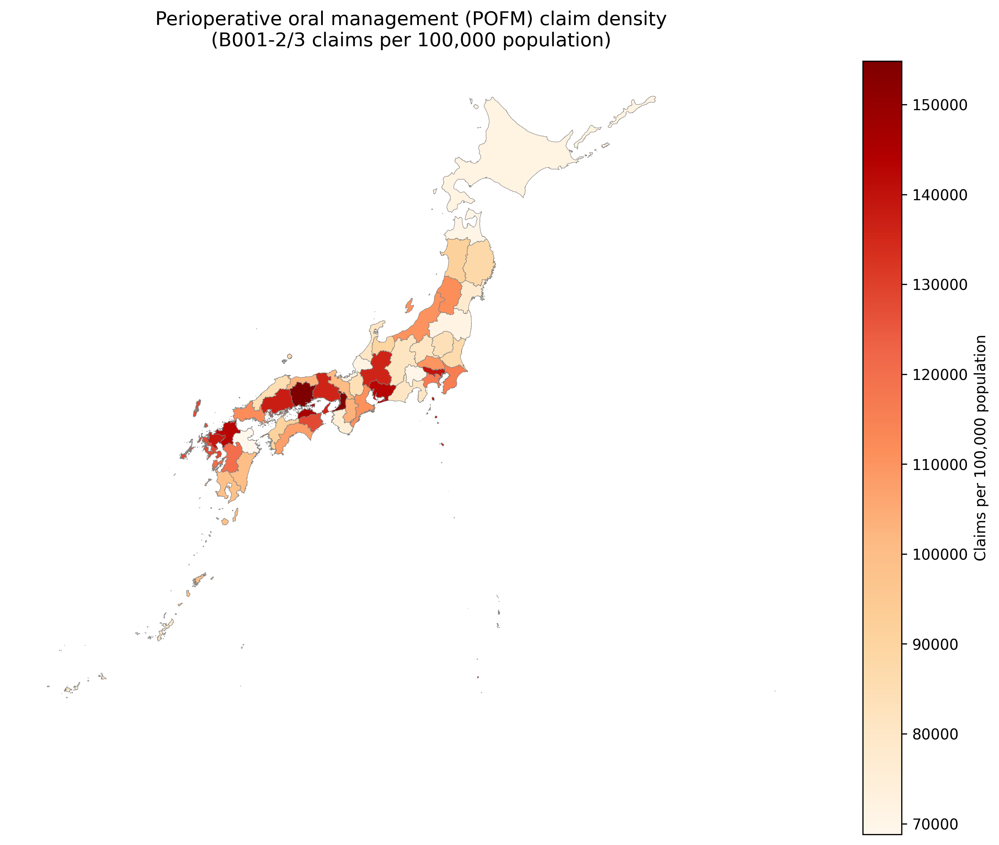
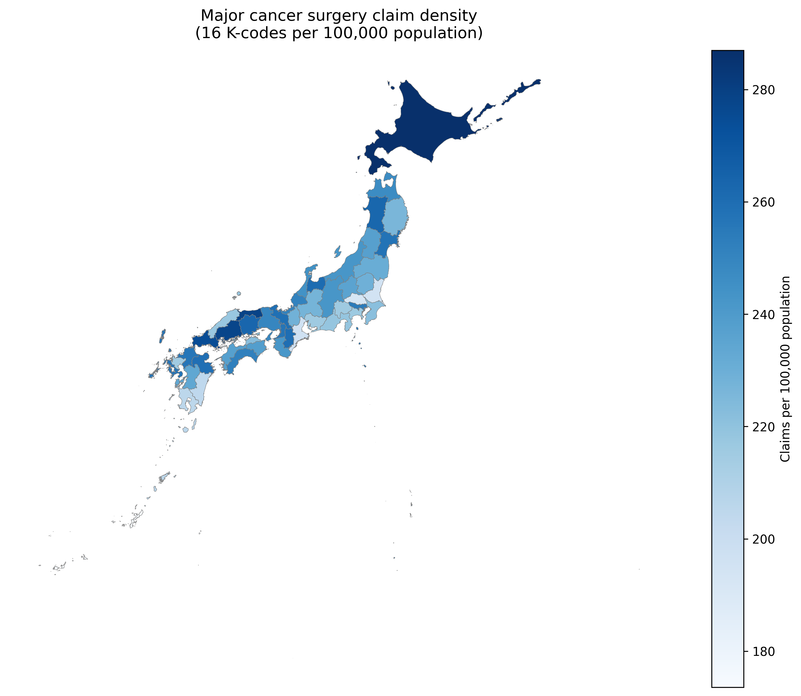
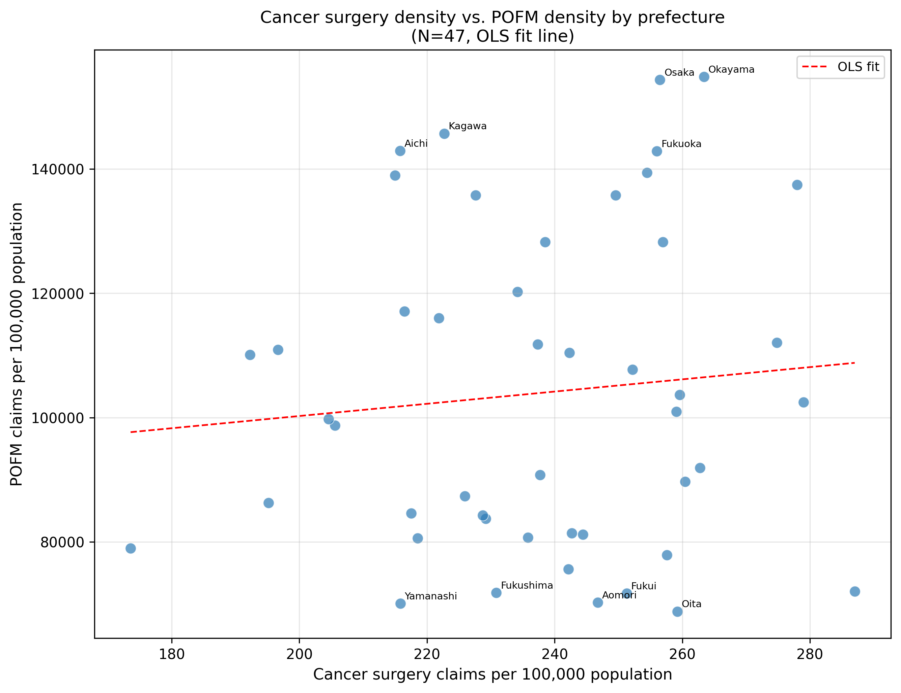
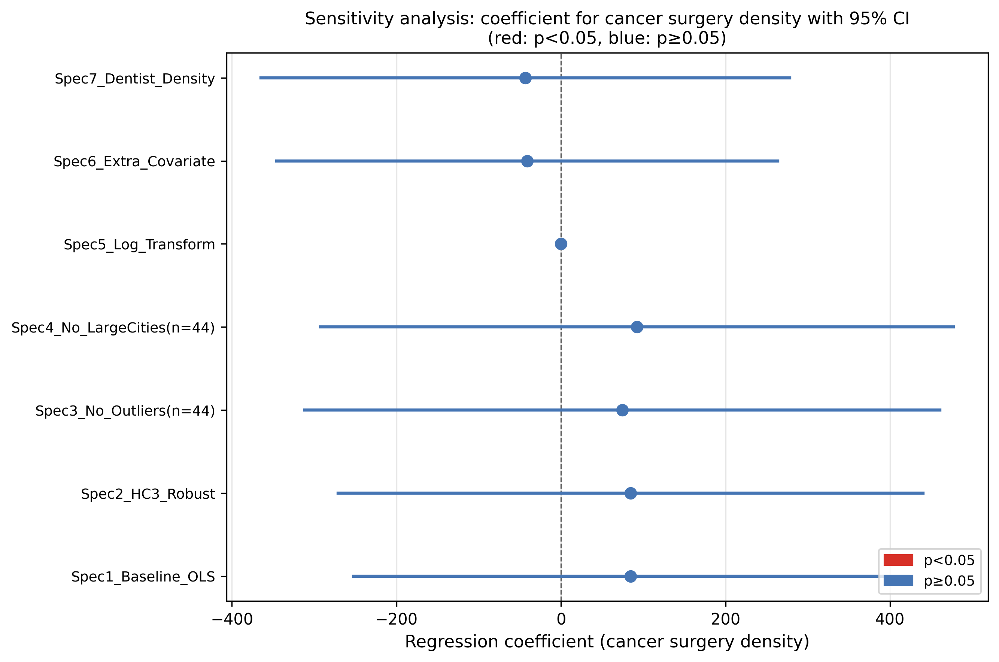
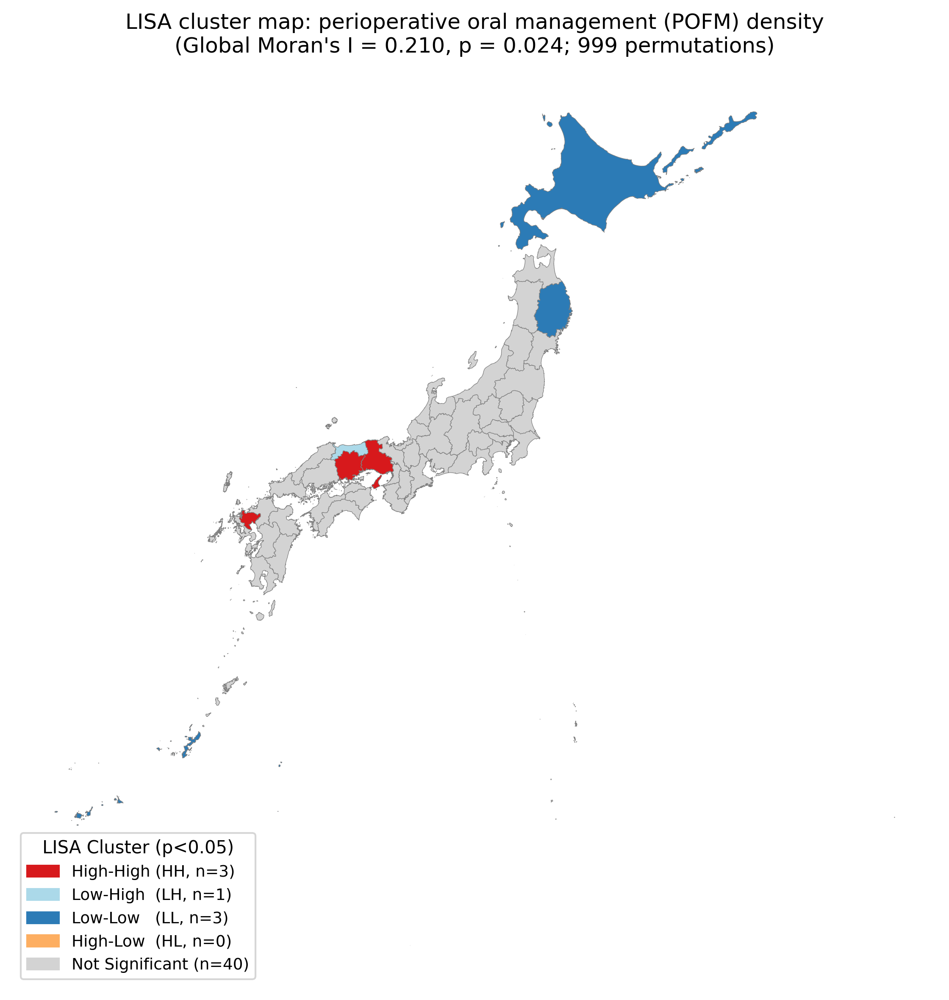
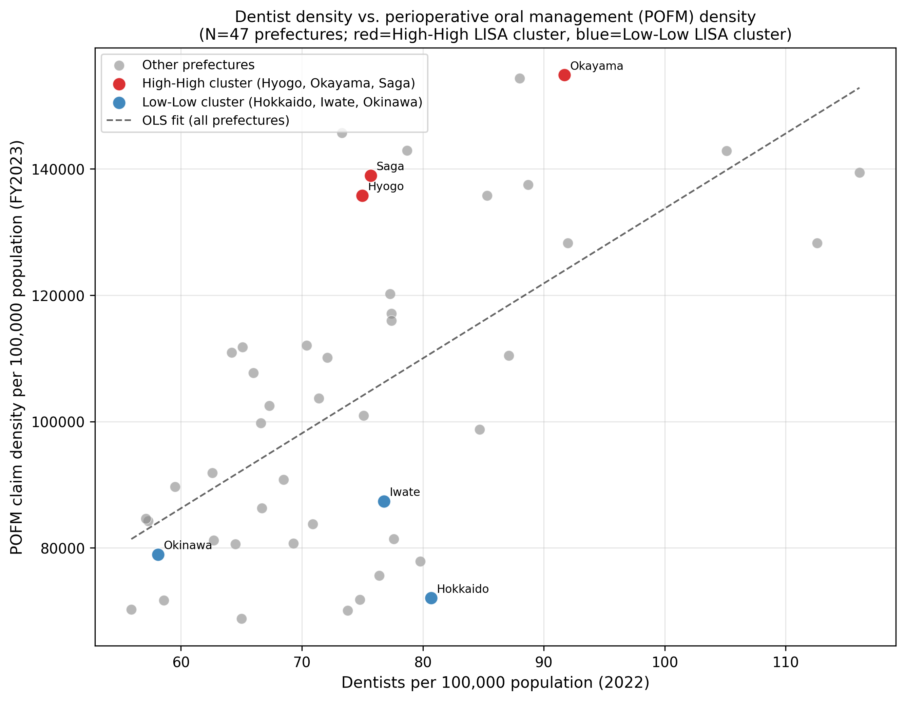

<!-- Health Policy (Elsevier) submission formatting -->
<!-- FLA: ≤4,000 words main text | ≤4 figures+tables | double-anonymized peer review -->
<!-- Main figures (body): Figure 1 (POFM choropleth) + Figure 5 (LISA map) = 2 figures -->
<!-- Main tables (body): Table 1 (descriptive) + Table 2 (OLS regression) = 2 tables -->
<!-- Appendix: Figures 2, 3, 4, 6; Table 3 (SLM); Supplementary Table S1 -->

## Highlights {.unnumbered}

- POFM delivery varied 2.25-fold across 47 Japanese prefectures
- Cancer surgical demand was not associated with POFM (0/7 specifications)
- Dentist density was the strongest predictor of POFM (r = 0.617, p < 0.0001)
- Significant spatial clustering identified (Moran's I = 0.210, p = 0.024)
- Supply-side capacity, not surgical need, drives regional POFM inequity in Japan

---

# Abstract

**Background**: Perioperative oral functional management (POFM) has been promoted in Japan as part of integrated cancer care since its incorporation into the national fee schedule. However, regional variation in POFM provision at the prefectural level remains poorly characterised.

**Objective**: To characterise prefectural variation in perioperative oral functional management (POFM) delivery across Japan, examine whether this variation was associated with cancer surgical demand or with dental workforce supply, and assess spatial clustering of POFM implementation.

**Methods**: We conducted a cross-sectional ecological analysis using the 10th National Database of Health Insurance Claims and Specific Health Checkups (NDB Open Data; fiscal year 2023). The primary outcome was the prefectural POFM density, defined as the combined annual claim count for perioperative oral management fees (B001-2 and B001-3) per 100,000 population. The main exposure variable was major cancer surgery density (16 selected K-codes per 100,000 population). Ordinary least-squares (OLS) regression with HC3 robust standard errors was performed. Global Moran's I was used to test for spatial autocorrelation, followed by Lagrange Multiplier (LM) tests to select the appropriate spatial regression model.

**Results**: Among the 47 Japanese prefectures, POFM density ranged from 68,804 to 154,850 per 100,000 population (mean: 103,963; coefficient of variation [CV]: 19.6%), indicating a 2.25-fold prefectural variation. In unadjusted and adjusted OLS models, cancer surgery density was not significantly associated with POFM density (β = 98.3, p = 0.510 unadjusted; β = 84.7, p = 0.641 adjusted; R² = 0.197). Sensitivity analyses across seven specifications (0/7 significant) confirmed the null association. In contrast, dentist density (dentists per 100,000 population; 2022) showed the strongest bivariate association with POFM density (r = 0.617, p < 0.0001). A significant positive spatial autocorrelation was identified (Moran's I = 0.210, p = 0.024). LM tests selected a Spatial Lag Model (SLM), which yielded a significant spatial autoregressive coefficient (ρ = 0.354, z = 3.14, p = 0.002), confirming geographic spillover in POFM uptake. Cancer surgery density remained non-significant in the SLM (β = 114.2, p = 0.431). Local Moran's I analysis identified three High-High clusters (Hyogo, Okayama, Saga prefectures) in western Japan and three Low-Low clusters (Hokkaido, Iwate, Okinawa).

**Conclusions**: Prefectural POFM density was strongly correlated with dental workforce supply (r = 0.617, p < 0.0001) but not with cancer surgical demand, and exhibited significant spatial clustering (Moran's I = 0.210, p = 0.024). These findings suggest that supply-side factors — particularly dental workforce capacity — rather than patient need, primarily drive geographic inequity in perioperative oral care provision in Japan.

**Keywords**: perioperative oral care; supply-driven care; need-based care; universal health coverage; implementation capacity; NDB Open Data; ecological study; spatial autocorrelation; Japan

---

## Research in Context {.unnumbered}

**What is already known on this topic**

Universal health coverage aims to ensure that evidence-based care reaches patients according to clinical need. Japan incorporated perioperative oral functional management (POFM) into its national health insurance fee schedule in 2012, with further reimbursement expansion in 2020 and 2022. Prior studies have documented postoperative benefits of POFM at the patient and hospital level, but prefecture-level variation in POFM implementation had not been characterised.

**What this study adds**

This nationwide prefectural ecological analysis of Japan's NDB Open Data (fiscal year 2023) demonstrates a 2.25-fold variation in POFM claim density across 47 prefectures. Cancer surgical demand—the primary clinical need indicator—was not significantly associated with POFM provision in any of seven pre-specified sensitivity specifications. By contrast, dentist density showed the strongest bivariate association (r = 0.617), and significant positive spatial autocorrelation was identified (Moran's I = 0.210, p = 0.024).

**How this study might affect research, practice or policy**

These findings indicate that reimbursement alone does not guarantee need-aligned implementation of POFM. Dental workforce capacity, hospital–dental integration, and referral infrastructure appear to be equally important determinants. For countries introducing perioperative oral care reimbursement, parallel investment in implementation capacity may be essential to prevent supply-driven inequity.

---

# Introduction

Perioperative oral functional management (POFM) is an evidence-based practice that reduces postoperative complications such as aspiration pneumonia, surgical site infections, and mucositis in patients undergoing major surgery, radiotherapy, or chemotherapy [@Ishimaru2018; @CamusJansson2023; @Shin2019; @Soutome2017; @Iwata2019; @Nobuhara2018; @Duan2025]. In Japan, POFM has been incorporated into the national health insurance fee schedule since 2012 and was further expanded in the 2020 and 2022 diagnostic fee revisions to include a broader range of surgical and oncological indications [@MHLW2022].

Despite these national initiatives, implementation rates may vary substantially across regions owing to differences in dental workforce capacity, hospital infrastructure, multidisciplinary care coordination, and patient access [@Kodama2021; @Ishimaru2022b; @Nomura2021; @Taira2021]. The 47 Japanese prefectures differ markedly in population density, aging rates, economic productivity, and healthcare resource distribution, all of which could influence the uptake of POFM.

The National Database of Health Insurance Claims and Specific Health Checkups (NDB) Open Data provides publicly available, prefecture-level aggregate statistics on medical and dental procedure claims in Japan [@MHLW_NDB2023; @Sato2024NDB]. By linking major cancer surgery claim counts with POFM management fee claim counts, this database offers a unique opportunity to characterise regional variation in POFM implementation at the ecological level.

The present study aimed to: (1) describe prefectural variation in POFM claim density across Japan; (2) examine the association between regional cancer surgical demand and POFM provision density; and (3) assess spatial clustering of POFM implementation.

---

# Methods

## Study Design and Setting

We conducted a cross-sectional ecological analysis at the prefectural level (N = 47) using the 10th NDB Open Data (fiscal year 2023: April 2023–March 2024) [@MHLW_NDB2023]. The unit of analysis was the 47 Japanese prefectures. This study used only publicly available aggregate statistics; individual-level data were not accessed. Ethical approval was not required, as only publicly available aggregate data were used. Methodological reviews of claims-based epidemiology in Japan support the use of these open datasets for population-level health services research [@Sato2024NDB].

## Data Sources

### Primary Outcome: POFM Density

The primary outcome was **perioperative oral management density** (POFM density), defined as:

$$
\text{POFM density} = \frac{\text{Annual claim count of B001-2 + B001-3}}{\text{Prefectural population}} \times 100{,}000
$$

where B001-2 (Perioperative Oral Functional Management Fee I) and B001-3 (Perioperative Oral Functional Management Fee II) are the dental management procedure codes covering the pre-operative assessment, intraoperative support, and post-operative management phases of POFM in the Japanese dental fee schedule. These codes are billed recurrently throughout the perioperative period; the density metric reflects the aggregate utilisation intensity across all POFM-eligible patients (including cancer surgery, chemotherapy, and radiation therapy patients) in each prefecture.

### Exposure Variable: Major Cancer Surgery Density

The primary exposure variable was **major cancer surgery density**, defined as the annual claim count for 16 selected K-codes (Table 1) per 100,000 prefectural population. The selected codes covered thyroid cancer surgery (K463), pulmonary resections (K511, K513, K514-2), oesophageal resection (K529-2), gastrectomy (K655, K655-2), hepatectomy (K695, K695-2), colectomy (K719, K719-2, K719-3, K721-4), rectal resection (K740, K740-2), and nephroureterectomy (K773-2). All codes were extracted from the national inpatient procedure statistics published in the same open-data release. These 16 procedures were selected to represent the principal oncological surgical procedures for which perioperative dental assessment and POFM referral are routinely recommended under the Japanese national health insurance fee schedule, encompassing the major cancer surgery types for which B001-2/3 claims are most frequently generated [@MHLW2022; @Ishimaru2018; @Shin2019; @Soutome2017; @Iwata2019; @Nobuhara2018; @Duan2025]. Because POFM eligibility also extends to chemotherapy and radiotherapy patients, cancer surgery density should be regarded as a pragmatic demand-side proxy rather than a comprehensive measure of total POFM-eligible need.

### Covariates

- **Aging rate**: Percentage of the population aged ≥65 years (fiscal year 2022), derived from the same publicly available prefectural statistics used to build the merged analytic file for this study
- **Per-capita income**: Ten-thousand Japanese yen units, from the same prefectural statistics
- **Population density**: Persons per km², from the same prefectural statistics
- **Physicians per 100,000 population** (sensitivity analysis only): Fiscal year 2023, included as an additional covariate in one sensitivity specification
- **Dentists per 100,000 population** (sensitivity analysis only): Calendar year 2022, derived from the Survey of Physicians, Dentists and Pharmacists (Ministry of Health, Labour and Welfare) [@MHLW_DentistSurvey2022], capturing the density of dentists working in medical facilities (hospitals and clinics)

## Statistical Analysis

### Primary Analysis

Descriptive statistics (mean, standard deviation, minimum, maximum, coefficient of variation) were calculated for all variables. Pearson correlation coefficients were computed to assess bivariate relationships among the main variables.

Two OLS regression models were estimated with HC3 heteroscedasticity-consistent standard errors. Model 1 (unadjusted) regressed POFM density on cancer surgery density alone. Model 2 (adjusted) additionally included aging rate, per-capita income, and population density.

### Sensitivity Analysis

A pre-specified **sensitivity analysis** comprising seven model specifications was performed with cancer surgery density as the focus predictor and POFM density as the outcome (when applicable). The specifications were: baseline OLS with conventional standard errors; the same model with HC3 robust standard errors (primary specification); exclusion of prefectures with Cook's distance greater than 4/n; exclusion of the three central prefectures of Japan's three major metropolitan areas (Tokyo, Osaka, and Aichi); log-transformation of both outcome and exposure; addition of physicians per 100,000 population as an extra covariate; and addition of dentists per 100,000 population as an extra covariate (Specification 7).

### Spatial Analysis

Spatial autocorrelation of POFM density was assessed using the Global Moran's I statistic with Queen contiguity weights and 999 random permutations [@Anselin1995]. When spatial autocorrelation was statistically significant, Lagrange Multiplier (LM) tests were applied to OLS residuals to determine whether a Spatial Lag Model (SLM) or Spatial Error Model (SEM) was more appropriate, following the decision rule of @Anselin1988: if LM-lag was significant and LM-error was not, SLM was selected; if both were significant, the robust LM (RLM) test was used as a tiebreaker; if neither was significant, OLS was deemed sufficient [@LeSage2009]. The selected spatial model was estimated by maximum likelihood.

Local spatial clustering was examined using Local Indicators of Spatial Association (LISA; Local Moran's I) with 999 permutations, classifying significant prefectures (p < 0.05) into High-High (HH), Low-High (LH), Low-Low (LL), or High-Low (HL) clusters [@Anselin1995].

### Post-hoc Statistical Power

Post-hoc statistical power was calculated using a non-central F distribution (α = 0.05), with Cohen's f² as the effect size metric [@Cohen1988].

All analyses were performed in Python 3.x using pandas, statsmodels, geopandas, libpysal, esda, and spreg.

---

# Results

## Descriptive Statistics

All 47 prefectures were included. POFM density showed a 2.25-fold variation across prefectures (range: 68,804–154,850 /100K), while cancer surgery density varied 1.65-fold (173.6–287.0 /100K). Among the covariates examined, dentist density (dentists per 100,000 population) showed the strongest bivariate association with POFM density (r = 0.617, p < 0.0001), followed by population density (r = 0.425, p = 0.003) and per-capita income (r = 0.387, p = 0.007). Cancer surgery density (r = 0.094, p = 0.529) and aging rate (r = −0.234, p = 0.114) were not significantly correlated with POFM density.

*(See Table 1)*

## Spatial Distribution of POFM and Cancer Surgery Density

The choropleth map of POFM density (Figure 1) reveals prominent regional clustering, with higher densities observed in the Tokai (central Honshu) and western Japan regions, and relatively lower densities in Hokkaido and parts of the Tohoku region. The corresponding choropleth of cancer surgery density (Figure 2) shows a different spatial pattern, with urban prefectures (Tokyo, Osaka, Aichi) exhibiting the highest surgical volumes, which does not mirror the POFM pattern.

*(See Figure 1 and Figure 2)*

## Association Between Cancer Surgery Density and POFM Density

The scatter plot (Figure 3) shows no clear linear association between cancer surgery density and POFM density across prefectures.

*(See Figure 3)*

*(See Table 2)*

In the adjusted model, the coefficients for aging rate (β = 538.6, p = 0.796), per-capita income (β = 10.5, p = 0.645), and population density (β = 7.2, p = 0.254) were also non-significant. Adjusted R² = 0.121.

## Sensitivity Analysis

The Forest plot (Figure 4) summarises the cancer surgery density coefficient across seven sensitivity specifications. None of the seven specifications yielded a statistically significant association (p < 0.05; 0/7 specifications significant), confirming the robustness of the null finding. In Specification 7 (adjusted additionally for dentist density), cancer surgery density remained non-significant (p > 0.05), while the inclusion of dentist density did not materially alter other model estimates.

*(See Figure 4)*

## Spatial Autocorrelation and Spatial Regression

Global Moran's I for POFM density was **I = 0.210 (p = 0.024)**, indicating statistically significant positive spatial autocorrelation; neighbouring prefectures tend to have more similar POFM densities than would be expected by chance. Two prefectures lacked Queen contiguity neighbours in the administrative boundary matrix and were assigned median neighbourhood weights in the spatial weights matrix.

Lagrange Multiplier tests on OLS residuals yielded: LM-lag = 7.65 (p = 0.006) and LM-error = 7.45 (p = 0.006). Both were significant; the robust LM-lag (RLM-lag = 1.52, p = 0.217) was smaller than RLM-error (1.32, p = 0.251), indicating that the **Spatial Lag Model (SLM)** was the more appropriate specification [@Anselin1988].

The SLM produced a significant spatial autoregressive coefficient of **ρ = 0.354 (z = 3.14, p = 0.002)**, confirming that prefectures with high (or low) POFM density are geographically contiguous — i.e., that POFM uptake spills over into neighbouring prefectures. Cancer surgery density remained non-significant in the SLM (β = 114.2, z = 0.79, p = 0.431), consistent with the OLS null finding. The SLM explained 35.0% of variance (pseudo-R² = 0.350) and achieved a lower AIC than the OLS model (SLM: 1081.1 vs. OLS: 1087.1; ΔAIC = −6.0), indicating superior fit (**Table 3**).

*Full regression coefficients for all covariates in the spatial lag model are provided in the supplementary materials.*

Local Moran's I (LISA) analysis identified three **High-High (HH) clusters** — Hyogo, Okayama, and Saga prefectures in western Japan — and three **Low-Low (LL) clusters** — Hokkaido, Iwate, and Okinawa (Figure 5). No High-Low or significant Low-High clusters were detected (p ≥ 0.05 for 40 of 47 prefectures). The geographic pattern of HH and LL clusters aligns with the choropleth observations and confirms that high-utilisation and low-utilisation regions form spatially coherent clusters rather than being randomly distributed.

*(See Figure 5)*

---

# Discussion

## Summary of Findings

This prefectural ecological analysis of POFM provision in Japan identified four principal findings: (1) a substantial 2.25-fold variation in POFM density across the 47 prefectures; (2) a null association between regional cancer surgical demand and POFM density, robust across seven sensitivity specifications; (3) a strong positive association between prefectural dentist density and POFM density (r = 0.617, p < 0.0001); and (4) significant positive spatial autocorrelation, indicating geographic clustering of POFM uptake.

## Interpretation of the Null Association Between Surgical Demand and POFM Density

The absence of a significant association between cancer surgery density and POFM density — even after adjusting for aging rate, income, and population density — suggests that POFM implementation is not simply proportional to patient need (as proxied by surgical volume). Several explanations are plausible.

First, POFM eligibility in the current fee schedule extends beyond cancer surgery to encompass chemotherapy, radiation therapy, and other major surgical indications [@MHLW2022]. The B001-2/3 denominator therefore reflects aggregate demand from a much broader population than the 16 cancer surgery K-codes used as the exposure, which may attenuate any demand–implementation correlation.

Second, supply-side factors — including the density of hospital dental departments, the availability of trained POFM dental providers, and institutional multidisciplinary pathways — likely exert greater influence on local uptake than patient demand alone [@Kodama2021; @Ishimaru2022b; @Nomura2021].

Third, historical implementation momentum may explain regional variation: prefectures and university hospitals that introduced POFM programmes early may have maintained disproportionately high utilisation levels regardless of changes in surgical case mix. Health-care innovation diffusion and regional variation in service uptake are well documented in Japan and internationally [@Greenhalgh2004; @Ibuka2020].

## Spatial Regression and LISA Clustering

The significant spatial autoregressive coefficient in the SLM (ρ = 0.354, p = 0.002) implies that POFM uptake exhibits genuine geographic spillover: a prefecture's POFM density is positively associated with the density in its neighbours, independent of the demand and socioeconomic covariates in the model. Spatially correlated uptake is consistent with regional diffusion mechanisms — including inter-institutional professional networks, dental school outreach programmes, and shared hospital dentistry staff pools — that propagate POFM practices across administratively contiguous areas [@Ishimaru2022b; @Taira2021; @Ibuka2020; @Seo2022].

The SLM's superior fit relative to OLS (ΔAIC = −6.0) and its 78% improvement in explained variance (pseudo-R² = 0.350 vs. OLS R² = 0.197) underscore the importance of accounting for spatial dependence in healthcare utilisation analyses at the prefectural level [@LeSage2009]. Critically, the null association between cancer surgery density and POFM density was preserved in the SLM (β = 114.2, p = 0.431), reinforcing that demand proxied by surgical volume does not drive implementation.

The LISA map (Figure 5) localised the spatial signal to three HH clusters — Hyogo, Okayama, and Saga, all in the Kinki–Chugoku–Kyushu corridor — and three LL clusters — Hokkaido, Iwate, and Okinawa. The HH prefectures include centres with long-standing perioperative team models and medical–dental collaboration (e.g., university hospital programmes in the region) [@Taira2021; @Okayama2017; @Kunitomi2025]. The LL prefectures — a remote northern island, a Tohoku inland prefecture, and a southwestern island territory — represent geographically peripheral areas with historically lower healthcare infrastructure density, consistent with documented geographic variation in medical expenditure and dental care utilisation in Japan [@Taira2021; @Ibuka2020; @Shirakura2024].

## Supply-Side Determinants of POFM Provision

The absence of a demand–implementation relationship underscores the primacy of supply-side factors in POFM provision. Three principal mechanisms warrant consideration.

First, **dental workforce capacity** is a critical determinant. In the present study, prefectural dentist density (dentists per 100,000 population; 2022 data) showed the strongest bivariate association with POFM density (r = 0.617, p < 0.0001), suggesting that supply of dental professionals — rather than demand from cancer surgery caseload — is the dominant driver of POFM uptake at the prefectural level. This is ecologically plausible: the HH clusters (Okayama: 91.7/100K, 5th nationally; Saga: 75.7/100K, 20th; Hyogo: 75.0/100K, 22nd) include prefectures with above-average dentist density, whereas LL clusters include Okinawa (58.1/100K, 44th nationally), which has among the lowest dentist densities in Japan [@MHLW_DentistSurvey2022]. Nationwide hospital surveys further confirm that dentist employment, inpatient dental referral patterns, and perioperative oral care capacity are uneven across Japanese facilities [@Kodama2021; @Ishimaru2022b]. Dental hygienists' roles in perioperative oral care and ward nurses' confidence in oral care skills likewise vary across institutions [@Nomura2021; @Takazawa2026; @Koike2022]. Prefectural inequalities in dental care utilisation and dentist distribution are well documented [@Taira2021; @Hashimura2018; @Yamamoto2023access], corroborating the spatial pattern of LL clusters observed in this study.

*(See Figure 6)*

Second, **multidisciplinary care infrastructure** — including the presence of oral medicine specialists, cancer care committees with dental representation, and standardised referral protocols — facilitates POFM implementation regardless of surgical caseload. University-affiliated comprehensive cancer centres with embedded dental departments are likely to disproportionately anchor HH clusters [@Taira2021; @Kunitomi2025].

Third, **fee-schedule implementation lags** may contribute to regional heterogeneity. The 2020 and 2022 fee revisions expanded POFM indications and reimbursement rates, but uptake of new fee categories requires institutional registration and credentialled personnel — creating a diffusion lag that may propagate spatially as centres with early adoption share expertise with neighbouring facilities [@MHLW2022; @Greenhalgh2004; @Sato2023dental].

## Comparison With Prior Studies

Prior Japanese studies have examined POFM at the hospital or patient level and consistently documented benefits in reducing postoperative complications [@Ishimaru2018; @Shin2019; @Soutome2017; @Iwata2019; @Nobuhara2018]. However, prefectural-level analyses of POFM provision density using nationally representative administrative data have not been previously reported to our knowledge. The present study adds a macro-level, ecological perspective that complements patient-level efficacy evidence.

## Strengths and Limitations

**Strengths**: The NDB Open Data provide publicly available, prefecture-level aggregate claims for Japan [@MHLW_NDB2023; @Sato2024NDB], enabling a nationwide ecological view of POFM density. Seven sensitivity specifications systematically assessed robustness of the null association. Spatial analysis (Moran's I, LM tests, SLM, LISA) characterised geographic clustering and spillover in POFM uptake. The integration of dental workforce density data from the national physician-dentist-pharmacist survey provided a quantitative supply-side covariate not previously examined in this context.

**Limitations**: First, as with all ecological analyses, individual-level inferences cannot be drawn (ecological fallacy [@Morgenstern1998; @Greenland2001]); prefecture-level correlations may not reflect patient-level relationships. Second, the primary outcome (POFM claim density) captures claim counts rather than unique patients, reflecting utilisation intensity but not the proportion of eligible patients actually receiving POFM. Third, the 16 cancer surgery K-codes represent only a subset of POFM-eligible patients; chemotherapy and radiation therapy patients, who also qualify for B001-2/3, are not captured in the exposure variable, likely attenuating the demand–implementation correlation. Fourth, although prefectural dentist density was included as a supply-side covariate, other important supply-side factors remain unmeasured — notably hospital dental department density, proportion of cancer-designated hospitals, and dental school outreach activity — and may have additionally confounded both the null finding and the spatial structure. Future studies with facility-level supply-side data linkage would help disentangle these mechanisms. Fifth, the cross-sectional design precludes causal inference, and temporal dynamics of the fee revision rollout (2020 and 2022) cannot be assessed with single-year data. Sixth, with N = 47 prefectures, statistical power was limited: post-hoc power analysis (non-central F distribution, α = 0.05) estimated power at approximately 9.7% for the unadjusted model (Cohen's f² = 0.009) and 73.0% for the adjusted model (f² = 0.245), below the conventional 80% threshold. To achieve 80% power for a medium effect size (f² = 0.15) with four predictors, approximately N = 85 administrative units would be required — exceeding Japan's fixed unit of 47 prefectures [@Cohen1988]. The null finding should therefore be interpreted as an absence of detectable association at this ecological resolution rather than proof of no association; Type II error cannot be excluded. Finally, two prefectures that are islands in the Queen contiguity matrix were assigned median neighbourhood weights, which may marginally influence the spatial regression estimates.

## Policy Implications

Substantial prefectural variation in POFM density, combined with spatial spillover and LL clusters in peripheral regions, supports geographically targeted strengthening of hospital–dental collaboration, workforce training, and inter-prefectural knowledge transfer from HH clusters. Fee-schedule expansion alone may be insufficient without addressing supply-side capacity [@MHLW2022; @Ishimaru2022b].

Beyond Japan, these findings carry implications for health systems considering the introduction of perioperative oral care reimbursement. As POFM efficacy in reducing postoperative complications is well established [@Ishimaru2018; @CamusJansson2023; @Shin2019; @Soutome2017; @Iwata2019; @Nobuhara2018; @Duan2025], reimbursement may increasingly be adopted internationally. However, this study suggests that coverage alone may be insufficient: parallel investment in dental workforce development, hospital-dental integration, referral pathway infrastructure, and multidisciplinary care routines may be equally necessary to translate formal eligibility into equitable access to evidence-based perioperative care.

## Conclusions

This ecological analysis demonstrated substantial prefectural variation in perioperative oral management provision in Japan (2.25-fold range), which was not explained by regional cancer surgical demand. A Spatial Lag Model confirmed significant geographic spillover (ρ = 0.354, p = 0.002), and LISA analysis localised HH clusters to western Japan (Hyogo, Okayama, Saga) and LL clusters to peripheral regions (Hokkaido, Iwate, Okinawa). These findings suggest that supply-side and institutional factors — dental workforce capacity, hospital-dental integration, and regional professional networks — primarily govern POFM implementation disparities, and that geographic diffusion processes are operating at the prefectural level. Targeted policy interventions to strengthen POFM supply capacity in low-utilisation peripheral regions, combined with inter-prefectural knowledge-sharing from established HH clusters, represent a pragmatic strategy to reduce geographic inequity in perioperative oral care in Japan.

---

# Acknowledgments

The authors thank the Ministry of Health, Labour and Welfare of Japan for providing access to the NDB Open Data. All data used are publicly available aggregate statistics.

# Conflicts of Interest

The authors declare no conflicts of interest.

# Data Availability

The NDB Open Data used in this analysis are publicly available from the Ministry of Health, Labour and Welfare of Japan (https://www.mhlw.go.jp/stf/seisakunitsuite/bunya/0000177182.html). Analysis code is openly available on GitHub (https://github.com/haruki00430/NDB_POFM) and archived on Zenodo (https://doi.org/10.5281/zenodo.20755757).

# Author Contributions

Haruki Saito: Conceptualization, Data curation, Formal analysis, Investigation, Methodology, Software, Visualization, Writing – original draft, Writing – review and editing.

Tetsuya Ohira: Conceptualization, Supervision, Writing – review and editing.

# Funding

None declared.

# Declaration of Generative AI and AI-Assisted Technologies in the Manuscript Preparation Process

During the preparation and writing of this work, the authors used AI-assisted tools to support manuscript drafting and statistical analysis scripting. Cursor 3.0 (Anysphere) and Google Antigravity (Google) were used for AI-assisted writing and Python code development. Large language models used through these platforms included Claude Sonnet 4.6 and Claude Opus 4.8 (Anthropic) and GPT-5.5 (OpenAI) and Gemini 3 Pro (Google). These tools were used only for text drafting and code generation; no generative AI or AI-assisted tools were used to create, alter, or otherwise process any figures, images, or artwork in this manuscript. The authors reviewed and edited all AI-assisted outputs and were responsible for the study design, selection of statistical methods, interpretation of findings, conclusions, and final reference list. The authors take full responsibility for the integrity and accuracy of the final content. AI was not listed as an author.

---

# References

::: {#refs}
:::

---

# Tables

**Table 1. Descriptive statistics for all 47 prefectures**

| Variable | Mean (SD) | Min | Max | CV (%) |
|---|---|---|---|---|
| POFM density (/100K) | 103,963 (20,390) | 68,804 | 154,850 | 19.6 |
| Cancer surgery density (/100K) | 237.7 (28.5) | 173.6 | 287.0 | 12.0 |
| Aging rate (%) | 31.2 (3.1) | 24.4 | 38.3 | — |
| Per-capita income (¥10K) | 3,039 (280) | 2,553 | 4,055 | — |
| Population density (persons/km²) | 329 (482) | 63 | 6,363 | — |
| Dentists per 100,000 population | 77.0 (12.9) | 55.9 | 116.1 | 16.7 |

---

**Table 2. Main regression results: POFM density vs. cancer surgery density**

| Model | n | β (cancer surgery density) | SE | p-value | 95% CI | R² |
|---|---|---|---|---|---|---|
| Model 1: Unadjusted | 47 | 98.3 | 153.3 | 0.510 | −210.2, 406.9 | 0.009 |
| Model 2: Adjusted | 47 | 84.7 | 178.9 | 0.641 | −275.5, 444.9 | 0.197 |

*Adjusted model: adjusted for aging rate, per-capita income, and population density.*

---

**Table 3. Spatial Lag Model (SLM) results**

| Parameter | Estimate | z-statistic | p-value |
|---|---|---|---|
| Spatial lag (ρ) | 0.354 | 3.14 | **0.002** |
| Cancer surgery density (β) | 114.2 | 0.79 | 0.431 |
| Aging rate | — | — | — |
| Per-capita income | — | — | — |
| Population density | — | — | — |
| Pseudo-R² | 0.350 | — | — |
| AIC | 1081.1 | — | — |

*Full regression coefficients for all covariates in the spatial lag model are provided in the supplementary materials.*

---

# Figures

<!-- Health Policy submission: Main body figures = Figure 1 (POFM choropleth) + Figure 5 (LISA map) -->
<!-- Figures 2, 3, 4, 6 → Appendix Figures A1–A4 in final submission DOCX -->

## Main Figures {.unnumbered}

**Figure 1**: Prefectural distribution of perioperative oral management (POFM) density (B001-2 + B001-3 claim counts per 100,000 population, FY2023).

{width=80%}

## Appendix Figures {.unnumbered}

**Appendix Figure A1** (QMD: Figure 2): Prefectural distribution of major cancer surgery density (16 K-codes per 100,000 population, FY2023).

{width=80%}

**Appendix Figure A2** (QMD: Figure 3): Scatter plot of cancer surgery density vs. POFM density by prefecture (N = 47). The dashed line indicates the OLS regression fit (β = 98.3, p = 0.510).

{width=75%}

**Appendix Figure A3** (QMD: Figure 4): Forest plot of cancer surgery density regression coefficients across seven sensitivity analysis specifications. Bars represent 95% confidence intervals. Red = p<0.05; Blue = p≥0.05.

{width=80%}

**Figure 5**: Local Indicators of Spatial Association (LISA) cluster map of POFM density across 47 Japanese prefectures (999 permutations, p < 0.05). Red = High-High (HH, n=3); Blue = Low-Low (LL, n=3); Light blue = Low-High (LH, n=1); Grey = Not significant (n=40).

{width=80%}

**Appendix Figure A4** (QMD: Figure 6): Scatter plot of prefectural dentist density (dentists per 100,000 population, 2022) vs. POFM density (B001-2 + B001-3 per 100,000 population, FY2023) across 47 Japanese prefectures. Red labels = High-High LISA clusters (Hyogo, Okayama, Saga); Blue labels = Low-Low LISA clusters (Hokkaido, Iwate, Okinawa); Black labels = other prefectures. The solid line indicates the OLS regression fit (r = 0.617, p < 0.0001).

{width=75%}

---

# Supplementary Material

**Supplementary Table S1. Full regression coefficients for the Spatial Lag Model (SLM)**

All model coefficients estimated by maximum likelihood using the SLM with Queen contiguity spatial weights (n = 47 prefectures).

| Parameter | Coefficient | z-statistic | p-value |
|---|---|---|---|
| Intercept | 103,519.5 | 1.17 | 0.241 |
| Cancer surgery density | 114.2 | 0.79 | 0.431 |
| Aging rate | −1,562.2 | −0.87 | 0.385 |
| Income per capita | −6.2 | −0.33 | 0.742 |
| Population density | 8.1 | 1.81 | 0.071 |
| Spatial lag (ρ) | 0.354 | 3.14 | **0.002** |
| Pseudo-R² | 0.350 | — | — |
| AIC | 1081.1 | — | — |
| Log-likelihood | −534.5 | — | — |
| n | 47 | — | — |

*Coefficients for aging rate, income per capita, and population density are non-significant (p > 0.05). The significant spatial autoregressive coefficient (ρ) confirms geographic spillover in POFM uptake.*
